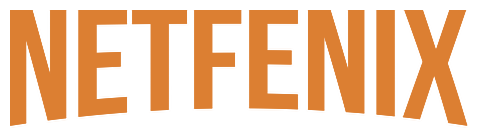
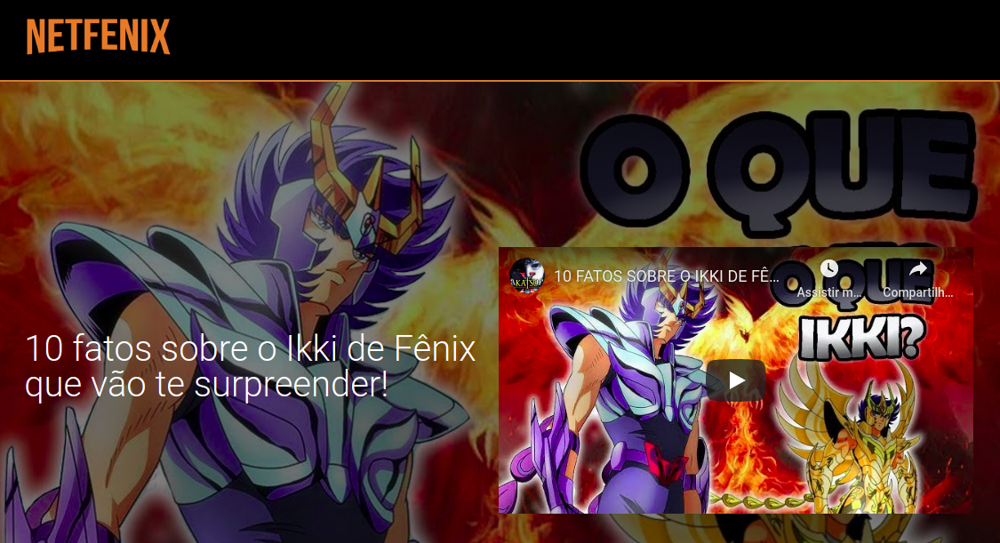
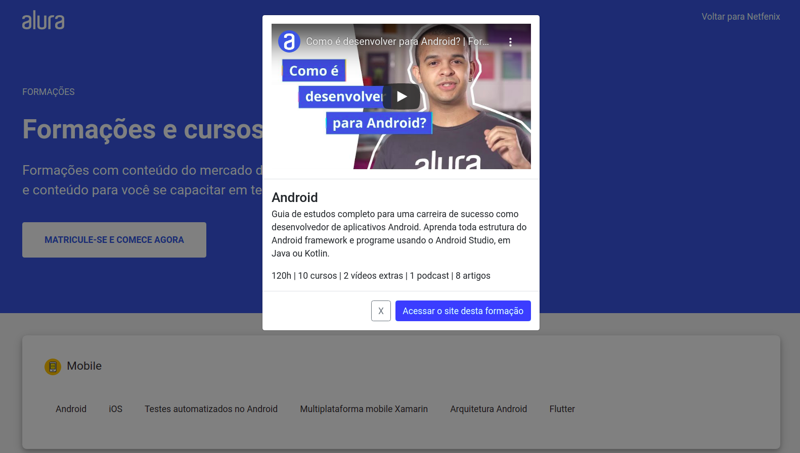

<h1 align="center">
  
</h1>

<br /><br />

<br><br><br>
<div align="center">
    
</div>

<br>

<p align="center">
  <a href="#sobre">Sobre o projeto</a> | 
  <a href="#tecnologias">Tecnologias</a> | 
  <a href="#run">Rodando o projeto</a> | 
  <a href="#contato">Contato</a>
</p>

<br>

<a id="sobre"></a>

## :rocket: Sobre o projeto

Este projeto foi desenvolvido na Imersão React da Alura. Trata-se de uma aplicação para apresentar alguns vídeos sobre os Cavaleiros do Zodíaco, por categorias "Cavaleiros de Ouro", "Cavaleiros de Bronze" e "Demais Cavaleiros".

Além disso, criei uma página de formações da Alura, que consome uma API.

[netfenix.vercel.app](https://netfenix.vercel.app)

<a id="tecnologias"></a>

## :computer: Tecnologias

O projeto foi desenvolvido utilizando as tecnologias:

- [ReactJS](https://reactjs.org/)
- [Bootstrap](https://www.npmjs.com/package/bootstrap)
- [React-Bootstrap](https://react-bootstrap.github.io/)
- [React Slick](https://www.npmjs.com/package/react-slick)
- [Styled Components](https://styled-components.com/)
- [JSON Server](https://www.npmjs.com/package/json-server)
- [Concurrently](https://www.npmjs.com/package/concurrently)

<a id="run"></a>

## :running: Rodando o projeto

1. Pré-requisitos:

- **[Node.js](https://nodejs.org/en/)**, **[Git](https://git-scm.com/)** e um gerenciador de pacotes (**[NPM](https://www.npmjs.com/)** ou **[Yarn](https://yarnpkg.com/)**) instalados na máquina.

2. Clonar o repositório:

```sh
  $ git clone https://github.com/testtzlaffe/netfenix.git
```

3. Iniciar o ambiente de desenvolvimento da aplicação react native:

```sh
  # Instalar as bibliotecas e as dependências
  $ npm install (ou yarn)

  # Iniciar a aplicação
  $ cd netfenix
  $ npm run dev (ou yarn dev)
```

<a id="contato"></a>

## :coffee: Contato

<h4>
    Gostou do projeto? Fique a vontade para mandar críticas ou sugestões. Se quiser iniciar um papo, conversar sobre este trabalho ou qualquer outro assunto, me chame no <a href="https://www.linkedin.com/in/christian-testtzlaffe-alpoim/" target="_blank">Linkedin</a>.
</h4>

---

<h4 align="center">
    Feito com 💜 por <a href="https://www.linkedin.com/in/christian-testtzlaffe-alpoim/" target="_blank">Christian Testtzlaffe Alpoim</a>
</h4>
